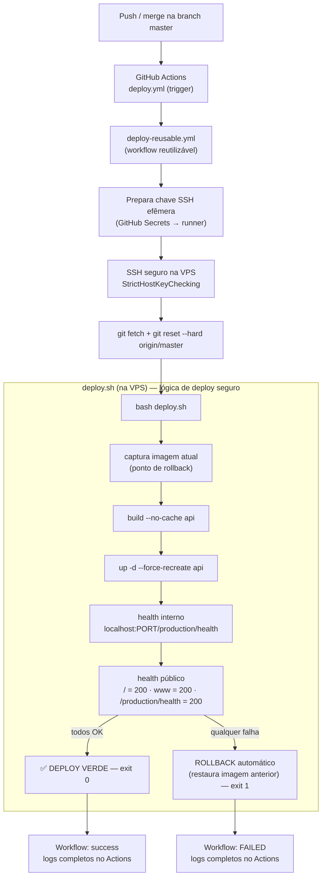

# Arquitetura do Pipeline de Deploy (CI/CD)

Publicação **100% automática**: nunca mais é preciso abrir a VPS para publicar.
O rollback e os health checks vivem no `deploy.sh` (fonte única da lógica de deploy
seguro); o GitHub Actions apenas orquestra o SSH e propaga o resultado.

## Princípios
- **Idempotente:** `reset --hard` + `build --no-cache` + `up --force-recreate` convergem sempre para o mesmo estado; rodar N vezes = rodar 1 vez.
- **Seguro:** segredos só em GitHub Secrets; chave SSH efêmera no runner (apagada em `always()`); `StrictHostKeyChecking` quando `SSH_KNOWN_HOSTS` é fornecido.
- **Rollback automático:** qualquer health check vermelho no `deploy.sh` restaura a imagem anterior e sai com código 1 → o workflow fica **failed** e o site permanece na última versão saudável.
- **Concorrência controlada:** `concurrency` impede dois deploys simultâneos no mesmo diretório da VPS.
- **Reutilizável:** `deploy-reusable.yml` serve este projeto e qualquer outro projeto AHRIOS (referência cross-repo).

## Fronteira de responsabilidade
| Camada | Responsabilidade |
|---|---|
| `deploy.yml` | Gatilho (push/manual) + mapeamento de secrets do projeto |
| `deploy-reusable.yml` | SSH seguro + `git sync` + invocar `deploy.sh` + propagar exit code |
| `deploy.sh` (VPS) | Build sem cache, recriação, **health checks**, **rollback** — **inalterado** |
